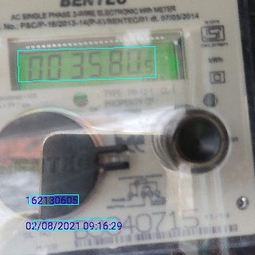
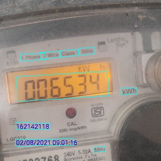
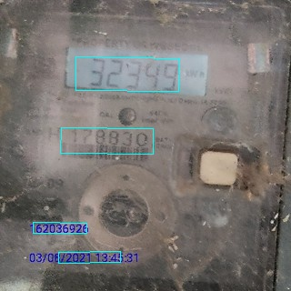
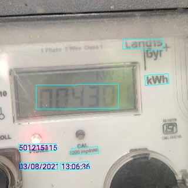

# Detection of seven segment fonts on electricity meeter display

### Introduction
This is a fine tuned tensorflow model to detect seven segment text, using [EAST text detection](https://github.com/argman/EAST)
The features are summarized blow:

### Contents
- [](#)
    - [Introduction](#introduction)
    - [Contents](#contents)
    - [Installation](#installation)
    - [Download](#download)
    - [Train](#train)
    - [Demo](#demo)
    - [Test](#test)
    - [Examples](#examples)
    - [Troubleshooting](#troubleshooting)

### Installation
1. Any version of tensorflow version > 1.0 should be ok.

### Download
1. Models trained on ICDAR 2013 (training set) + ICDAR 2015 (training set): [BaiduYun link](http://pan.baidu.com/s/1jHWDrYQ) [GoogleDrive](https://drive.google.com/open?id=0B3APw5BZJ67ETHNPaU9xUkVoV0U)
2. Resnet V1 50 provided by tensorflow slim: [slim resnet v1 50](http://download.tensorflow.org/models/resnet_v1_50_2016_08_28.tar.gz)

### Train
If you want to train the model, you should provide the dataset path, in the dataset path, a separate gt text file should be provided for each image
and run

```
python multigpu_train.py --gpu_list=0 --input_size=512 --batch_size_per_gpu=14 --checkpoint_path=/tmp/east_icdar2015_resnet_v1_50_rbox/ \
--text_scale=512 --training_data_path=/data/ocr/icdar2015/ --geometry=RBOX --learning_rate=0.0001 --num_readers=24 \
--pretrained_model_path=/tmp/resnet_v1_50.ckpt
```

If you have more than one gpu, you can pass gpu ids to gpu_list(like --gpu_list=0,1,2,3)

**Note: you should change the gt text file of icdar2015's filename to img_\*.txt instead of gt_img_\*.txt(or you can change the code in icdar.py), and some extra characters should be removed from the file.
See the examples in training_samples/**

### Demo
If you've downloaded the pre-trained model, you can setup a demo server by
```
python3 run_demo_server.py --checkpoint-path /tmp/east_icdar2015_resnet_v1_50_rbox/
```
Then open http://localhost:8769 for the web demo. Notice that the URL will change after you submitted an image.
Something like `?r=49647854-7ac2-11e7-8bb7-80000210fe80` appends and that makes the URL persistent.
As long as you are not deleting data in `static/results`, you can share your results to your friends using
the same URL.


### Test
run
```
python eval.py --test_data_path=/tmp/images/ --gpu_list=0 --checkpoint_path=/tmp/east_icdar2015_resnet_v1_50_rbox/ \
--output_dir=/tmp/
```

a text file will be then written to the output path.


### Examples
Here are some test examples!






### Troubleshooting
+ How to compile lanms on Windows ?
  + See https://github.com/argman/EAST/issues/120
