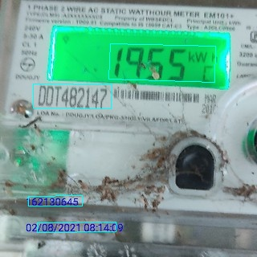

# Detection of seven segment fonts on electricity meeter display

### Introduction
This is a fine tuned tensorflow model to detect seven segment text on meeter images, using [EAST text detection](https://github.com/argman/EAST)

### Setup
Open a terminal and run to clone this repo locally
```
git clone https://github.com/renjithsasidharan/east-meeter-reading-detection

cd east-meeter-reading-detection
```

### How to create annotations
Annotations are present in `data/meeter_annotations` folder. If you want to create more annotations, you can add new images to `data/meeter_annotations` folder and use `labelme` to annotate.

  1. Copy new images to `data/meeter_annotations` folder
  2. Install `labelme` from https://github.com/wkentaro/labelme
  3. Open `labelme`  on folder `data/meeter_annotations`
  4. Select newly added image
  5. Annotate polygons around the reading text. Start from top-left, top-right, bottom-right, bottom-left in that order for polygons.
  6. 
  7. Add the label as `meeter-reading`
  8. Save annotation

### How to create training data from annotations.
  1. In terminal run 
     ```
     python create_training_data_meeter.py
     ``` 
     This will create training data in `data/training_data` folder.

### How to run training on Google Colab
  1. Create archive from `training_data` folder and name it as `training_data.zip`
  2. Go to https://colab.research.google.com/
  3. Upload the notebook, `east_training.ipynb` from this repo to Colab
  4. Upload `training_data.zip` file to google Colab files. Wait for the file to be uploaded, the transfer rate is low on Colab
  5. Select GPU runtime
  6. Run the notebook.
  7. When the ntoebook finish running, it will download the trained model `east_det_fp16.tflite` to your machine.

### Test
run
```
python eval.py --test_data_path=/tmp/images/ --gpu_list=0 --checkpoint_path=/tmp/east_icdar2015_resnet_v1_50_rbox/ \
--output_dir=/tmp/
```

a text file will be then written to the output path.


### Examples
Here are some test examples!




### Troubleshooting
+ How to compile lanms on Windows ?
  + See https://github.com/argman/EAST/issues/120
